[🇺🇦 Українська версія](README.ua.md)

# 🕵️ Multi-Accounting Architecture: A Technical Overview

> ⚠️ **DISCLAIMER**
>
> This article is strictly an overview material created solely for educational and research purposes. The author does not encourage fraud, violation of service terms, or deception of any systems.
>
> **Main Goal:** To study the phenomenon of multi-accounting as a technical occurrence and analyze how fundamental knowledge of computer systems, network protocols, and digital fingerprints is applied in practice within the Web3 sphere.

**Author:** Danylo Havryliuk
**GitHub:** [dan1l-git](https://github.com/dan1l-git)

---

In the modern digital space, especially within the Web3 ecosystem, there is a phenomenon of creating multiple digital identities (multi-accounting). From a technical standpoint, this is a complex infrastructure task where the primary goal is **isolation**.

For analytics systems and anti-fraud algorithms (e.g., CoinList, LayerZero, Galxe), every network entity must appear as a unique user with an authentic history and a distinct device. Below, we examine the architectural solutions used to achieve this goal.

## Part 1: Network Identity (IP and Proxies)

The IP address acts as the "passport" of a connection. Security systems analyze connection patterns: multiple requests from a single address by different accounts usually lead to an automatic ban.

### 1. The Role of the IP Address
It is a unique numerical identifier of a device on a network.
* **IPv4:** Standard format (`192.168.0.1`). Despite higher costs, it remains the priority due to full compatibility with web resources.
* **IPv6:** Newer protocol. Although cheaper, its usage is limited due to a lack of support on many crypto platforms.

### 2. Using Proxy Servers
A proxy serves as an intermediary, masking the user's real entry point. The industry distinguishes three main classes of proxies based on their Trust Score:

| Proxy Type | Description | Trust Score | Use Case |
| :--- | :--- | :--- | :--- |
| **Datacenter** | Addresses owned by hosting providers (Amazon, DigitalOcean). | **Low** 🔴. Systems easily identify them as server traffic. | Automation of simple tasks, non-critical processes. |
| **Residential** | Addresses belonging to real home internet service providers (ISPs). | **High** 🟢. Traffic is indistinguishable from a regular user. | Registrations on platforms with high security levels. |
| **Mobile** | Addresses of GSM operators (3G/4G/5G). | **Highest** 🟢🟢. Uses NAT technology, where thousands of subscribers share one external IP. | Complex tasks requiring IP rotation without risk of blocking. |

### 3. Data Transfer Protocols
* **HTTP(S):** Standard protocol suitable for browsers but may transmit header metadata.
* **SOCKS5:** Considered the standard for anonymization as it transmits data packets in a "pure" form without interpretation or modification.

---

## Part 2: Digital Fingerprint

Modern identification systems are not limited to IP addresses. They analyze the **Fingerprint**—a collection of hundreds of hardware and software parameters of the client.

**Key Analysis Vectors:**
1.  **User-Agent:** A string identifying the browser version and OS.
2.  **Canvas Hash:** A unique signature of 2D graphics rendering by the graphics card.
    * *Technical Nuance:* A discrepancy between the claimed User-Agent and the actual Canvas rendering method is a primary marker for bot detection.
3.  **WebGL:** Similar parameter for 3D graphics.
4.  **WebRTC:** Streaming technology that has a vulnerability—the potential to leak the real IP address bypassing the proxy.
5.  **Fonts:** The set of installed fonts, which varies depending on the user's profession and interests.
6.  **AudioContext:** Specifics of sound signal processing.

> **Masking Methodology:** Simply blocking the collection of this data is insufficient, as an "empty" fingerprint is an anomaly. Therefore, the technique of **spoofing** is applied—replacing real parameters with synthetic but valid data.

---

## Part 3: Anti-Detect Browsers

To implement spoofing, specialized software is used—anti-detect browsers. They allow the management of multiple isolated profiles.

**Working Principle:**
1.  Creating a virtual container (profile).
2.  Generating a consistent "legend" (e.g., user from Germany, Windows 10, NVIDIA GTX 1060 GPU).
3.  At the browser kernel level, generated data is injected in response to website requests, concealing the host machine's real parameters.

**Common Tools:**
There are solutions of varying complexity on the market, such as AdsPower, Dolphin{anty}, and Multilogin, which differ in functionality and pricing policy.

---

## Part 4: Typical Workflow

The process of deploying such infrastructure usually includes the following stages:

1.  **Network Layer Preparation:** Purchasing a pool of proxy servers (most often residential) to ensure a unique entry point for each profile.
2.  **Environment Configuration:**
    * Setting up profiles in the anti-detect browser.
    * Selecting a profile OS that correlates with the host system (Mac-to-Mac, Win-to-Win) to prevent font and rendering parameter conflicts.
3.  **Verification:**
    * Using specialized checker services (Whoer, Pixelscan) to analyze for leaks (DNS leaks, WebRTC leaks) and verify the "Trust Score" of the generated fingerprint.
---

## Part 5: OpSec (Operational Security) and Blockchain Analysis

Successful imitation of a real user depends not only on browser settings but also on behavioral factors on the blockchain (On-Chain behavior).

### 1. Wallet Clustering Problem
The biggest mistake is direct interaction between "farm" accounts. The blockchain is a transparent ledger, and analytical tools easily build transaction graphs to detect connected groups of addresses (clusters).
* *Solution:* To break links, sub-accounts of centralized exchanges (CEX) are used, acting as "mixers" by distributing funds from the exchange's hot wallets.

```mermaid
graph TD
    CEX["Centralized Exchange (OKX / Binance)"]
    
    subgraph Farm ["Farm"]
        WalletA("Wallet A")
        WalletB("Wallet B")
        WalletC("Wallet C")
    end

    %% Correct Path
    CEX == "Withdrawal 1 (Clean)" ==> WalletA
    CEX == "Withdrawal 2 (Clean)" ==> WalletB
    CEX == "Withdrawal 3 (Clean)" ==> WalletC

    %% Incorrect Path (Sybil Link)
    WalletA -.->|❌| WalletB
    WalletB -.->|❌| WalletC
```

### 2. "Warm-up" (Cookie Farming)
A synthetically created "clean" browser profile arouses suspicion in security systems (Google, Cloudflare).
* *Practice:* Before starting active work, cookies are accumulated by visiting popular resources (YouTube, news portals), simulating organic user behavior.

### 3. Process Automation
Scaling activities (managing hundreds of accounts) makes manual work impossible.
* *Toolkit:* Scripts based on **Python (Selenium, Playwright)** or visual automation environments (BAS) are used to emulate human actions.

---

## 🔗 Useful Resources & Tools

A collection of tools and documentation mentioned in the article for a deeper study of the topic.

### 🛠️ Software Tools
* **[AdsPower](https://www.adspower.com)** — Popular anti-detect browser with flexible network settings.
* **[Dolphin{anty}](https://anty.dolphin.ru.com)** — Browser optimized for team work and automation in the crypto sphere.
* **[Selenium](https://www.selenium.dev)** — Library for automating web browser actions (Python/Java/C#).

### 🕵️ Anonymity Checkers (Verification)
These services allow verifying the quality of the configured Fingerprint and IP cleanliness:
* **[Whoer.net](https://whoer.net)** — Basic analysis of IP, DNS, and language/time settings.
* **[Pixelscan](https://pixelscan.net)** — Check for bot activity and fingerprint consistency.
* **[BrowserLeaks](https://browserleaks.com)** — Deep technical analysis (Canvas, WebGL, WebRTC, Fonts).
* **[Iphey](https://iphey.com)** — Trust check of the digital identity.

### 📚 Technical Documentation (Deep Dive)
For those who want to understand the theory:
* **[MDN Web Docs: Fingerprinting](https://developer.mozilla.org/en-US/docs/Glossary/Fingerprinting)** — What is fingerprinting (by Mozilla).
* **[EFF: Cover Your Tracks](https://coveryourtracks.eff.org)** — Research project on browser fingerprint uniqueness.

---

## Conclusions & Technical Summary

The phenomenon of multi-accounting is not just the use of a toolset but a complex engineering challenge demonstrating the evolution of the confrontation between client emulation methods and server-side analytics. It is an "arms race" where every new identification algorithm (Canvas Fingerprinting, behavioral analysis) is met with a corresponding counter-spoofing method.

For a technical specialist (Data Analyst, QA Engineer, Developer), analyzing this architecture provides a deep understanding of exactly how a "digital personality" is formed online. We see that modern user identification is based not on a single parameter but on the correlation of hundreds of micro-signals—from network protocols to graphics rendering specifics.

**Key Value of This Research:**
* **Understanding Vulnerabilities:** Knowing how a digital fingerprint can be spoofed is necessary for developing more advanced security systems and anti-fraud algorithms.
* **Network Literacy:** Analyzing the operation of proxies and anti-detect browsers deepens knowledge of HTTP/SOCKS5 protocols and browser kernel mechanisms.
* **Data-Driven Approach:** Success or failure in building such an infrastructure depends on the ability to analyze data and find non-obvious connections (clusters), which is a direct competency of a Data Analyst.

This study highlights the importance of a comprehensive approach to cybersecurity. It aims to raise the technical awareness of the community and demonstrate how transparent a user can be to global analytics systems if basic principles of digital hygiene are not followed.
